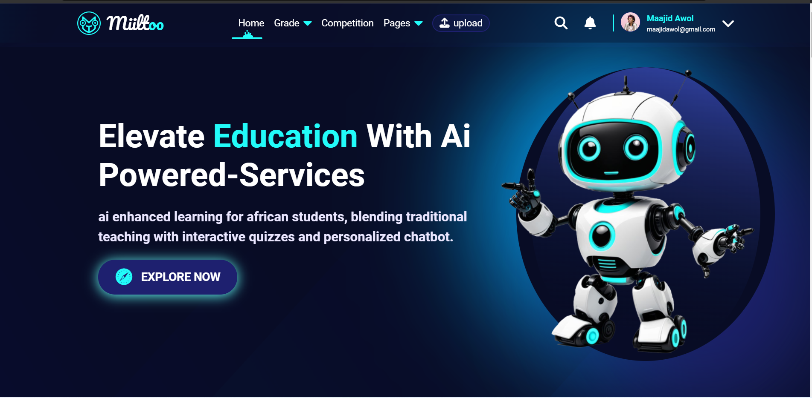

# Project README - Miiltoo: Knowledge Companion

## Team Information

**Project Title:** Miiltoo: Knowledge Companion

**Team Name:** Miiltoo

**Team Captain Name:** Abdulmajid Awol

**Team Members:**

| No. | Name             | Email              | Phone         | Country   |
| --- | ---------------- | ------------------ | ------------- | --------- |
| 1.  | Abdulmajid Awol  | maajidawol@gmail.com| +251993174585 | Ethiopia  |
| 2.  | Ararsa Derese    | ararsaderese6@gmail.com | +251946543376 | Ethiopia |
| 3.  | Abel Bekana      | abelbekanagot@gmail.com | +251966871742 | Ethiopia |
| 4.  | Abigiya Getachew | Bigu160715@gmail.com    | +251926815050 | Ethiopia |
| 5.  | Natnael Meseret  | natnaelmeseret5@gmail.com | +251987158100 | Ethiopia |

## Project Roadmap Planning

### Week 1: Roadmap Planning and Ideation | Sep 19, 2023 - Sep 27, 2023

**Milestone:**
- Gathering some information on the new features.
- Cleaning the codebase.
- Implementing custom file system (make users able to chat with their PDF).
- Creating User registration and login.
- Changing the UI/UX to make it more user-friendly.

**Deliverables:**
- Defined project scope and initial roadmap.
- More information for new features.
- Start design and implementation of better UI/UX.

### Week 2-4: Development and Prototyping | Sep 27, 2023 - Oct 16, 2023

#### Week 2:

**Milestone:**
- Features to be implemented this week:
  - Make users have their own profile page to edit their details and manage their PDF.
  - Make the web app ready for deployment.
  - Deploy the web app and make it online (if possible).
  - Create the first version of the telegram bot with minimalistic functionality.
  - Test the web app in 1 or 2 schools and gather feedback from students and teachers.

**Deliverables:**
- Functional implementation of features listed above and codebase of the implemented features.
- Testing the web app in 1 or 2 schools and gathering feedback from students and teachers.

#### Week 3:

**Milestone:**
- Features to be implemented this week:
  - Blogs.
  - Posts.
  - File sharing.
  - Prepare some sort of timely competition for students to participate.

**Deliverables:**
- Upgrade to Media Version to attract more users.

#### Week 4:

**Milestone:**
- Features to be implemented this week:
  - Add AI integrated feature.
  - Deploy the new version and collect feedback from users.
  - Integrate Google Analytics into our web app.
  - Implement security measures.

**Deliverables:**
- Basic prototype of core functionality.
- Functional implementation of features listed above and codebase of the implemented features.

### Week 5: Testing and Refinement | Oct 16, 2023 - Oct 23, 2023

**Milestone:**
- Begin testing and gather user feedback.

**Deliverables:**
- Identify and fix bugs.
- Implement user feedback.

### Week 6: Finalization and Presentation | Oct 23, 2023 - Oct 28, 2023

**Milestone:**
- Finalize the project and prepare for presentation.

**Deliverables:**
- Complete project features.
- Create presentation materials.
- Deployed product.

## Features and Functionality

### Core Features

1. **AI Chatbot with Curriculum-Based Personality**

   **Description:** This feature introduces a personalized AI chatbot designed specifically for high school students. Each chatbot is customized to the corresponding textbooks in the curriculum, giving these textbooks a unique and engaging personality. High school students can interact with these chatbots as if they were conversing with their curriculum books. This feature aims to make the learning experience more interactive and enjoyable.

2. **Quiz Generation from Customized AI Models**

   **Description:** This feature allows students to access customized AI models for each textbook. Users can select a particular chapter and subtopic from the book and use the AI model to generate quizzes. These quizzes are tailored to the selected content, helping students assess their understanding and knowledge retention. It provides an effective tool for self-assessment and reinforcement of learning. After they finish taking the quiz, students can see their evaluation and answers with explanations for each question.

3. **PDF Upload and Chatbot Interaction**

   **Description:** Feature 3 extends the functionality of the platform to accommodate users beyond high school students. Any user, regardless of their educational background, can upload PDF files. The system then creates a customized AI model based on the content of the uploaded PDF. Users can engage in chatbot conversations using this model and even take quizzes generated from the uploaded content. This feature empowers individuals to interact with and learn from their own data and documents, making the platform versatile and accessible to a broader audience.

## Technology Stack

### Frontend

- Figma (for UI/UX design)
- HTML, CSS, and JavaScript (for development)
- Bootstrap (in some cases for styling)

### Backend

- Flask (for building the backend of web apps)
- SQLAlchemy (for ORM)
- SQLite (database)
- LangChain (for embedding the pretrained model with our data)

### AI Models

- OpenAI’s gpt-3.5-turbo (for chat and quizzing with the data)

### Other Tools

- Git (version control)
- Docker (for containerization)
- AWS S3 (for storing media files)

## Dependencies (if applicable)

### Data Sets

**Data Sources:** Ethiopian Ministry of Education High School textbooks (from grade 9-12)

**Data Integration:** We integrated the data into the model using a Python library called LangChain, which allows

 embeddings to pretrained models.

### APIs

**Model Integration:** We integrated OpenAI’s gpt-3.5-turbo through the LangChain library.

## Challenges, Risks, and Mitigation Plan

**Challenge:** One of our primary challenges revolves around our utilization of OpenAI's model, which entails certain payment considerations. Our project is currently reliant on the complimentary $5 credit provided upon signing up for the service, and we anticipate the possibility of depleting this initial allocation.

**Mitigation Plan:** We are actively researching to find the best quality free AI model that can meet our project's requirements. Our goal is to ensure the sustainability and accessibility of our project even in the absence of significant funding.

---

**Note:** We strongly suggest focusing your efforts on refining your project idea and planning during the first week. Use the last week for preparing your presentation and giving your project a final polish. During the weeks in between, concentrate on developing and testing your project.

*This README document provides an overview of the Miiltoo project, its objectives, roadmap, features, technology stack, and potential challenges.*
